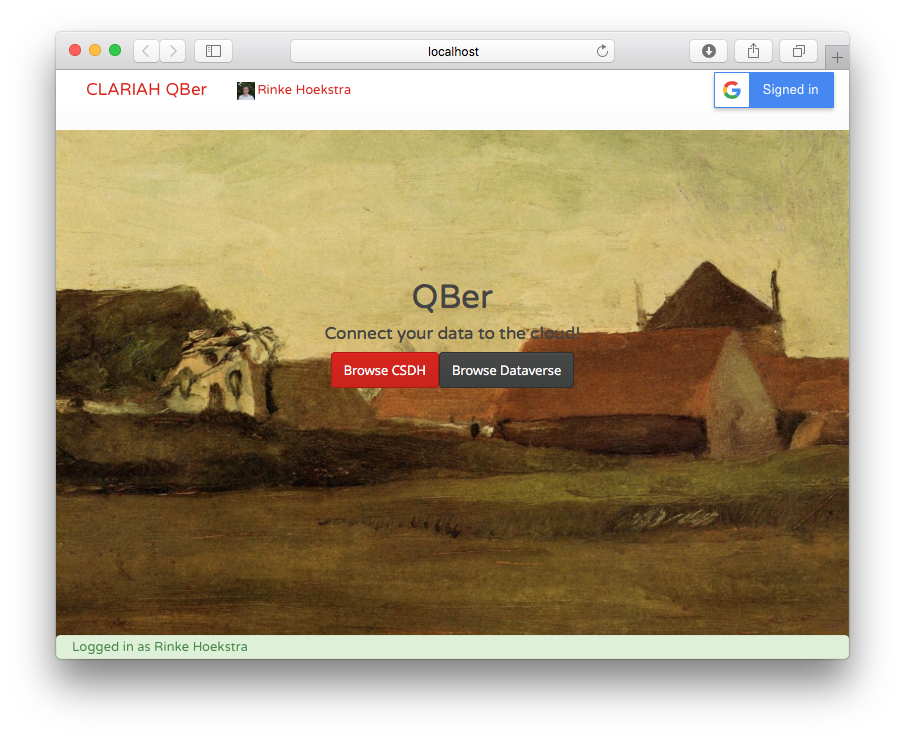

## QBer
**Author:**	Rinke Hoekstra  
**Copyright:**	Rinke Hoekstra, VU University Amsterdam  
**License:**	MIT License (see [license.txt](license.txt))  

QBer is a tool for automatically converting CSV or SAV files that contain statistical data (currently tailored for census data) to the [RDF Data Cube vocabulary of the W3C](http://www.w3.org/TR/vocab-data-cube/).

### Installation

##### Prerequisites

* Make sure you have a working version of the [CSDH API](https://github.com/CLARIAH/wp4-csdh-api) running (or can connect to one hosted elsewhere).
* Make sure you have [Node.js](http://nodejs.org) installed, including its package manager `npm`. Test this by running e.g.
```
npm --version
```
in a terminal window.
* If you don't have it, follow the instructions at [Node.js](http://nodejs.org). For MacOS users, we recommend you use [Homebrew](http://brew.sh) to install `npm` and its dependencies:
```
brew install npm
```

#### Installing QBer

Clone the `master` branch of this repository to a directory of your choice:

```
git clone https://github.com/CLARIAH/qber.git
```

Change into the `src` subdirectory of the folder you just created, and run:

```
npm install
```

In case gulp is not available in your environment, you'll need to install it globally:

```
sudo npm install -g gulp
```

This should install all required packages.

###### Silly step

Edit the `QBerAPI.js` file in the `src/js/utils` directory and set the `CSDH_API` variable to the HTTP address of the CSDH instance of your choice, e.g.:

```!javascript
var CSDH_API = "http://localhost:5000"
```

or

```!javascript
var CSDH_API = "http://api.clariah-sdh.eculture.labs.vu.nl"
```

#### Running QBer

Change into the `src` subdirectory of the QBer folder, and run `gulp`:

```
gulp
```

This automatically opens a browser window with QBer:



If this is not the case, it will be running at the `http://localhost:8000` address.  

Your terminal window should see something like:

```
[12:07:55] Using gulpfile ~/qber/src/gulpfile.js
[12:07:55] Starting 'clean'...
[12:07:55] Finished 'clean' after 23 ms
[12:07:55] Starting 'default'...
Hello QBer!
[12:07:55] Starting 'transform'...
[12:07:55] Starting 'webserver'...
[12:07:55] Webserver started at http://localhost:8000
[12:07:55] Finished 'webserver' after 9.56 ms
[12:07:55] Finished 'default' after 46 ms
[12:07:58] all files 1.17 MB
[12:07:58] Finished 'transform' after 2.61 s
```

#### Known issues

QBer has only been tested using the Google Chrome browser. Other browsers may not work as expected (e.g. Safari doesn't always show the login button)

If you experience any unexpected behavior, please report it using the GitHub issues tracker.
