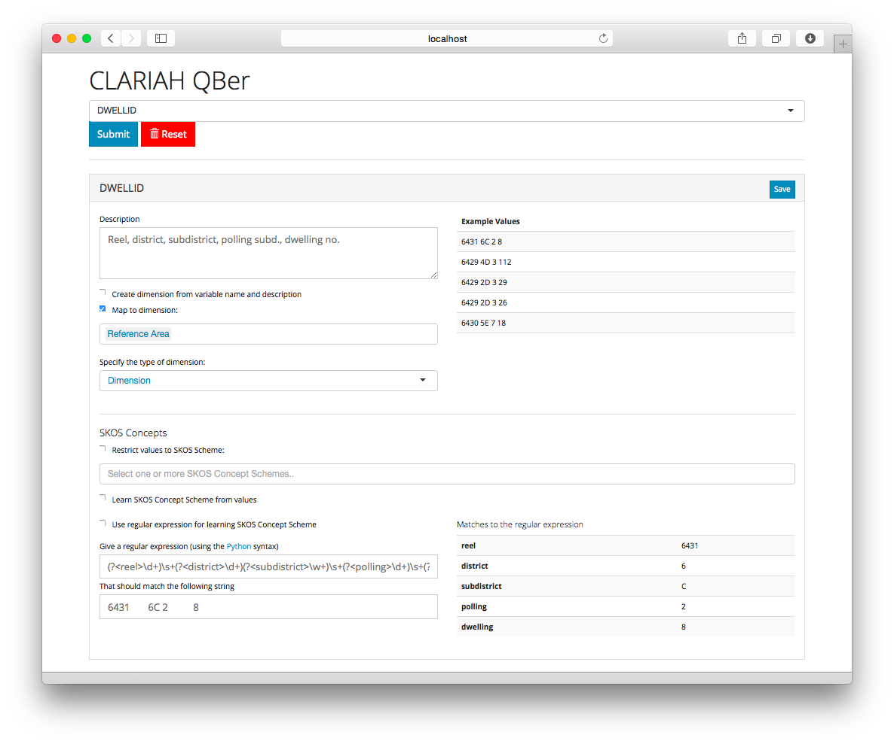

## QBer
**Author:**	Rinke Hoekstra  
**Copyright:**	Rinke Hoekstra, VU University Amsterdam  
**License:**	MIT License (see [license.txt](license.txt))  

QBer is a tool for automatically converting CSV or SAV files that contain statistical data (currently tailored for census data) to the [RDF Data Cube vocabulary of the W3C](http://www.w3.org/TR/vocab-data-cube/).

### Installation

First, open a terminal or console and clone the QBer git repository to a directory of your choice:

`git clone https://github.com/CLARIAH-SDH/qber.git`  
(you can also download the source from Github)

Change directory to directory and then (to keep things nice and tidy) use [virtualenv](http://virtualenv.pypa.io) to create a virtual environment, and activate it:

`virtualenv .`

and

`source bin/activate` (on unix/linux-style systems)

Then install the required Python packages using [pip](https://pip.readthedocs.org):

`pip install -r requirements.txt`

Change directory to `src` and then:

`python run.py`

the QBer application will be running on <http://localhost:5000> (click this link, or copy it to your browser).

Make sure to always activate the virtualenv before running QBer again.

### Caveat Emptor

QBer is work in progress. For it to work properly, you need to give it apointer to the dataset to load. (and to be entirely honest, it doesn't really do very much yet)

This is currently specified in the `canada.json` file, located in the `src/loader` directory. 
* QBer will only load the *first* dataset listed. 
* Make sure the path points to the proper SPSS file (the path is relative to the `src` directory). 
* For CSV files (untested), change the value for `format` to `CSV`. 
* There also is the option to load a file that specifies the to-be-expected metadata for the data (this is a two-column CSV file with variable-names in the first column, and a description in the second). The default configuration loads from `metadata/canada_1901.csv`.

